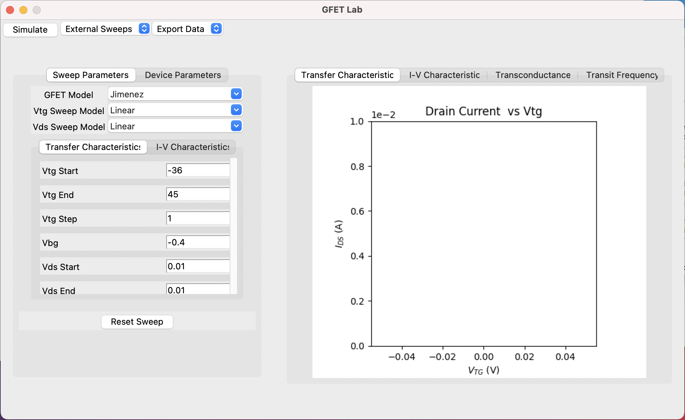
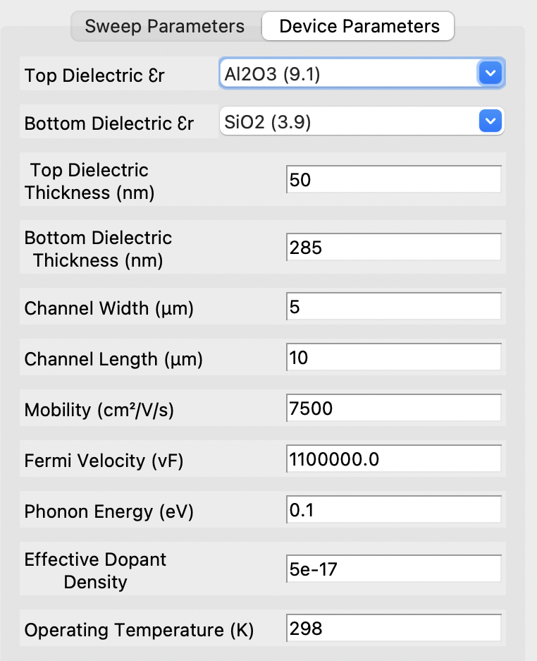
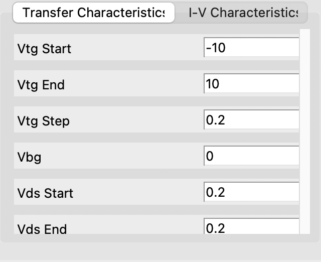
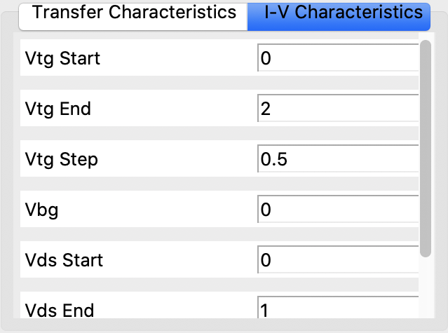
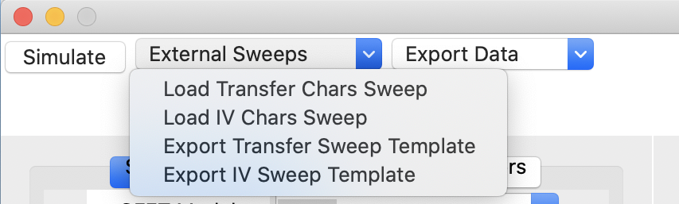
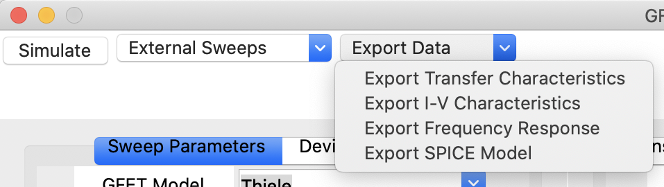

# gfet-simulator Usage Guide

## Python Program to Model GFET Characteristics

*Author: Nathaniel Tye (njt48@cam.ac.uk)*
*Date: 16.02.2021*

## Getting Started:

N.B.: Before starting, please see the README to familiarise yourself with the purpose of this tool and make sure any dependencies are include, and also to see any known issues and/or planned improvements.

To run the program, simply open the 'main.py file.

When opening the program, you will be presented with the following screen:

The left panel is where all the simulation parameters and control is done.

'GFET Model' allows you to select the particular GFET model you wish to use. There are some issues with some of the models (see README for more information), however the Jimenez model seems to be the most reliable and accurate so far, as well as being SPICE-compatible. Thus, we reccommend you use this model for the time being.

## Device Parameters:

Before applying any sweeps or exporting models, you probably want to establish the device you're investigating. If you click the 'Device Parameters' tab on the main screen, you will be presented with the following:

As you can see, there are a number of default values and their corresponding units. 'Fabricating' a new device is as simple as typing in a new number for the device you want to build. For example, if you decided to build a GFET with a 100nm long and 50nm wide channel, simply enter 0.1 and 0.05 into the 'Channel Width' and 'Channel Length' boxes respectively. The top and bottom dielectric thicknesses determine the oxide capacitance between the graphene channel and the top and back gates respectively, and are as easy to change as the channel dimensions.

The first two drop down boxes allow you to choose a dielectric material. Currently, SiO2, AlO3, HfO2 and monolayer h-BN are included, but this can be updated in the Dielectrics.txt file. Not all models include a back gate (e.g. Rodriguez), or your sweep may not use a back gate, so the second parameter may have little to no impact on the resulting device characteristics.

The mobility is the inherent mobility of the channel, and can be determined from the slope of the drain current with respect to the gate voltage. This is an empirical parameter and is useful for comparing the behaviour of an ideal (modelled) GFET to a real, fabricated device.

Not every model makes use of all the available parameters and the following are only used by certain models. This means that not all parameters will affect the resulting characteristics. To avoid confusion, the applicable models will be given in brackets before the description.

(Rodriguez, Thiele)
The surface-phonon energy determines phonon scattering between the graphene channel and the dielectric. This is typically on the order of 10-100 meV and is material dependent. A default value for Al2O3 is used here, however you should verify the correct value to make sure your simulations are accurate.

(Rodriguez, Thiele, Hu)
The effective dopant density is an empirical factor to reflect dopants in the graphene channel, e.g. those that appear due to the fabrication process or e.g. atmospheric doping. This is typically a very small number, on the order of 10^-17 /cm2.

(Jimenez, Thiele, Hu)
The Fermi velocity is a parameter typically available in the literature.

(Hu)
Temperature is the operating temperature of the device, default is room temp. Only the model of Hu et al. accounts for this.

## Generated Sweep Models:

### Transfer Characteristics (Dirac Point):
'Vtg Sweep Model' determines to type of voltage sweep to be applied for the GFET transfer characteristic curves. 'Linear' generates a linearly-spaced model between the user-defined start and end voltages, with spacing determined by the 'Vtg Step' parameter. 'Dual-Linear' is the same as a linear except with a forward and reverse sweep. In real devices, this would generally show hysteretic behaviour, however the models currently implemented do not include this. 'Logarithmic' sweeps generates logarithmically-spaced datapoints between the user-defined start and end voltages.

 

The Vds bias voltage can also be set. For a sweep with a single bias voltage, simply set 'Vds Start' and 'Vds End' to the same value. If you wish to plot multiple sweeps, e.g. the transfer characteristics for different Vds biases, set 'Vds Start' to the lowest bias you wish to use and 'Vds End' to the highest. 'Vds Step' is used to determine the step size. For example, if you wish to step Vds from 0.2 V to 1 V, set 'Vds Start' to 0.2, 'Vds End' to 1 and 'Vds Step' to 0.2.

In the case of a dual-gated (i.e. top and bottom gate) device, you can also set a Vbg voltage, which allows you to shift the Dirac point position. At present, this cannot be swept, and so behaves as a universal back gate. The Rodriguez model does not account for a back gate and so this option is disabled for the model.

### I-V/Output Characteristics:

'Vds Sweep Model' behaves identically to the 'Vtg Sweep Model', except it governs the sweep used for simulation of the I-V characteristics. Here, 'Vds Start', 'Vds End' and 'Vds Step' take the place of 'Vtg Start' 'Vtg End' and 'Vds Step' respectively in the Vtg Sweep Model.

 

Analogous to stepping the Vds bias in the transfer characteristics sweep, you can step the gate voltage in the output characterstics sweep. In this case, 'Vtg Start, 'Vtg End' and 'Vtg Step' take the place of 'Vds Start', 'Vds End' and 'Vds Step' respectively. 

### Resetting Sweeps:

If you've changed the sweep models drastically and want to reset to the deafult, simply click the 'Reset Sweep' button at the bottom of the sweep parameters pane.

### External Sweep Models:

As well as program-defined sweep models, this tool also has the option to import a custom sweep from a .csv file. The program expects a particular format otherwise the input may not be what you expect. The tool therefore allows you to export a template CSV file which you can enter your sweep data into (i.e. gate/source-drain voltage points) to ensure correct operation. To load a custom sweep, click the 'External Sweeps' button at the top:

 

Here, clicking 'Load Transfer Chars Sweep' or 'Load I-V Chars Sweep' will bring up a file dialog allowing you to choose a custom I-V or transfer sweep from any directory on your computer. Likewise, 'Export Transfer Chars Sweep' or 'Export I-V Chars Sweep' allow you to export a template file to a given directory.

## Running Simulations:

When you have entered your desired device and sweep parameters, simply click the 'Simulate' button in the top-left corned of the window to run the simulation

### Simulation Output:

The right hand panel of the program window shows the simulation output. Here, there are windows displaying scatter plots of the resulting transfer characteristics and I-V characteristics, as well as the calculated transconductance and transit frequency for the simulated GFET. You can switch between plot simply by clicking the desired tab, as you would in a web browser.

N.B.: the calculations of both transconductance and transit frequency aren't properly implemented at this time, so are of limited use.

## Exporting Data:

When you are are happy with the device characteristics, you can export a .csv file of the simulation for further analysis. To do this, click the 'Export Data' button at the top of the screen:

 

'Export Transfer Characteristics' will export the simulated transfer characteristics for the device. If you have a stepped Vds sweep, you will get a pair of gate voltage and drain current columns for each Vds step. Otherwise, you will simply see a .csv file with the Vds voltage and a column for the gate voltage and corresponding drain current.

'Export I-V Characteristics' exports a .csv file with a similar format to the transfer characteristics file, except the Vds steps are replaced by gate voltage steps, and the gate voltage sweep is replaced by a drain voltage sweep. 

'Export Frequency Response' outputs a .csv file with the Vds bias voltage, (multiple if a stepped sweep is used), the gate voltage sweep, resulting drain current and the calculated transit frequency.

'Export Spice Model'
This allows you to export a .lib file which you can import into your SPICE simulator software of choice (e.g. PSpice, LTSpice, HSpice) for use in circuit-level simulations. These SPICE files will contain all the specified parameters of the simulated device, as well as the relevant equations describing device behaviour. These are implemented in SPICE as an arbitrary behavioural current source (B Source). To use these models in LTSpice, open the .lib file in LTspice, place your cursor on the top line (i.e. the line which reads '.subckt GFET_[model name]...') and click 'Create Symbol' .

N.B.: exported SPICE models have only been developed for and tested with LTSpice at the time of writing, so may require adaptation for other software.
